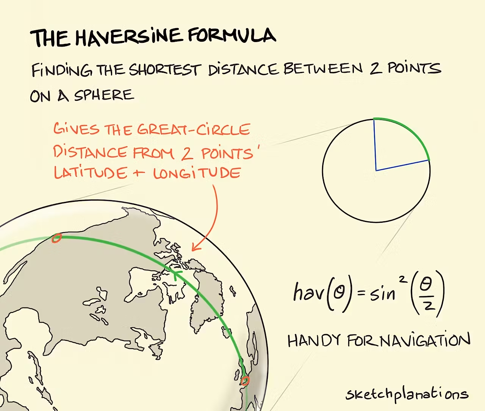

[](https://www.npmjs.com/package/angular-haversine-geolocation) 

# angular-haversine-geolocation

An **Angular 20** service (Web & Standalone Components) to manage a geolocation history, using the **Haversine formula** to filter out nearby points and optimize tracking.

---


---

## 🚀 Installation

```bash
npm install angular-haversine-geolocation
```

or with yarn:

```bash
yarn add angular-haversine-geolocation

```

---

### ✨ Features

- 📍 Calculate distances in meters using the Haversine formula

- 🔄 Manage a geolocation history

- 🎯 Automatically filter out points that are too close to the previous one

- 💾 Flexible persistence (via localStorage, IndexedDB, APIs, etc.)

- 🪶 Compatible with Angular 20 (Web & Standalone Components)

---

## 🖥️ Live demo :

https://angular-haversine-goelocation-test.netlify.app/

---

### 🔧 Example Usage

```ts
import { Component, inject, signal } from '@angular/core';
import { CommonModule } from '@angular/common';
import { FormsModule } from '@angular/forms';
import {
  GeolocationManagerService,
  TLocation,
  TLocationHistory,
  provideGeolocationManager,
} from 'angular-haversine-geolocation';

@Component({
  selector: 'app-root',
  standalone: true,
  imports: [CommonModule, FormsModule],
  template: `
    <h1>Location History</h1>

    <ul>
      <li *ngFor="let loc of history().locations">
        Latitude: {{ loc.coords.latitude }}, Longitude: {{ loc.coords.longitude }} - Time:
        {{ getFormattedTimestamp(loc.timestamp) }}
      </li>
    </ul>

    <h2>Add a Position Manually</h2>
    <label>
      Latitude:
      <input type="number" [(ngModel)]="latitude" step="0.0001" />
    </label>
    <label>
      Longitude:
      <input type="number" [(ngModel)]="longitude" step="0.0001" />
    </label>
    <button [disabled]="!initialized" (click)="addManualLocation()">Add Position</button>
  `,
  providers: [
    provideGeolocationManager({
      distanceThreshold: 50,
      loadHistory: async () => JSON.parse(localStorage.getItem('geo-history') || 'null'),
      saveHistory: async (h) => localStorage.setItem('geo-history', JSON.stringify(h)),
    }),
  ],
})
export class AppComponent {
  private geo = inject(GeolocationManagerService);

  history = signal<TLocationHistory>({ locations: [] });

  // Inputs for coordinates
  latitude = 48.8566;
  longitude = 2.3522;

  // Flag to know if init() is completed
  initialized = false;

  constructor() {
    this.init();
  }

  private async init() {
    // Initialize the service and retrieve existing history
    await this.geo.init();
    this.geo.history$.subscribe((h) => this.history.set(h));
    this.initialized = true;
  }

  async addManualLocation() {
    // Create a new location with the current timestamp
    const newLocation: TLocation = {
      coords: {
        accuracy: 5,
        altitude: 10,
        altitudeAccuracy: 1,
        heading: 0,
        latitude: this.latitude,
        longitude: this.longitude,
        speed: 0,
      },
      mocked: false,
      timestamp: Date.now(),
    };

    // Add the location via the service with await for persistence
    await this.geo.addLocation(newLocation);
  }

  getFormattedTimestamp(ts: number): string {
    // Convert to local string taking into account the user's timezone
    return new Date(ts).toLocaleString();
  }
}
```

### 📖 API

GeolocationManagerService

**_Methods_**

- history$ → Observable<TLocationHistory>

- historySnapshot → TLocationHistory

- init(customOptions?: Partial<GeolocationOptions>) → Promise<void>

- addLocation(location: TLocation) → Promise<void>

- provideGeolocationManager(options: Partial<GeolocationOptions>)

- distanceThreshold?: number → Threshold in meters to consider two positions the same (default: 100)

- loadHistory: () => Promise<TLocationHistory | null> → Function to load history

- saveHistory: (history: TLocationHistory) => Promise<void> → Function to save history

---

### 🧩 Types

**_TLocation_**

```ts
export type TLocation = {
  coords: {
    accuracy: number;
    altitude: number;
    altitudeAccuracy: number;
    heading: number;
    latitude: number;
    longitude: number;
    speed: number;
  };
  mocked: boolean;
  timestamp: number;
};
```

**_TLocationHistory_**

```ts
export type TLocationHistory = {
  locations: TLocation[];
};
```

**_GeolocationOptions_**

```ts
export type GeolocationOptions = {
  distanceThreshold?: number;
  loadHistory: () => Promise<TLocationHistory | null>;
  saveHistory: (history: TLocationHistory) => Promise<void>;
};
```

---

### 📐 Distance Calculation (Haversine)

The distance between two GPS points is calculated using the Haversine formula, which determines the great-circle distance between two points on a sphere using their latitude and longitude.



This formula is useful for:

Filtering out GPS points that are too close to each other.

Reducing noise in location tracking.

Optimizing storage and performance by avoiding redundant points.

Function signature:

```ts
getDistanceInMeters(lat1, lon1, lat2, lon2): number
```

#### Example

```ts
import { getDistanceInMeters } from 'angular-haversine-geolocation';
const distance = getDistanceInMeters(48.8566, 2.3522, 40.7128, -74.006);
console.log(`Distance: ${distance.toFixed(2)} meters`);
```

---

### 📜 License

MIT
